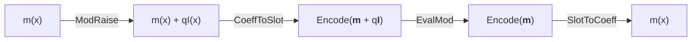
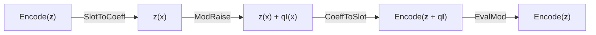

# Bootstrapping in HEonGPU

Homomorphic encryption allows computations to be performed on encrypted data without decryption. However, as computations progress, the noise in the ciphertext grows, eventually making further operations impossible. Bootstrapping is the process of "refreshing" a ciphertext to reduce this noise, enabling deeper computations and extending the lifespan of the ciphertext.

Currently, HEonGPU supports `4` different bootstrapping types for the `CKKS` scheme. In the near future, support for the `TFHE` scheme will be added, including `TFHE` bootstrapping to enable efficient bit-level encrypted computations.

## CKKS Bootstrapping

The `CKKS` bootstrapping implementation in HEonGPU demonstrates the initialization and execution of the bootstrapping process entirely on the GPU.

#### [CKKS Regular Bootstrapping](1_ckks_regular_bootstrapping.cu)

<div align="center">


</div>

In cases where the message is a complex number, Regular Bootstrapping is applied. 

<div align="center">
m(x) = Encode(<b>m</b>) where <b>m</b> &in; &#8450 
</div>

The [1_ckks_regular_bootstrapping.cu](1_ckks_regular_bootstrapping.cu) provides a basic example of `Regular` bootstrapping with a polynomial degree of 4096. While functional, these parameters are insecure for practical use, as `CKKS` bootstrapping typically requires a modulus of 65536 for sufficient noise budget and security. This example is intended for demonstration purposes only and should not be used in a production environment.

#### [CKKS Slim Bootstrapping](2_ckks_slim_bootstrapping.cu)

<div align="center">


</div>

Unlike `Regular` Bootstrapping, `Slim` Bootstrapping is designed for messages in the real number domain. The bootstrapping process begins with `Slot To Coeff` (StoC) rather than ModRaise, ensuring that EvalMod is applied exclusively to the real part of the message. For a comprehensive explanation and technical details, please refer to the papers listed below.

<div align="center">
m(x) = Encode(<b>m</b>) where <b>m</b> &in; &reals;
</div>

The [2_ckks_slim_bootstrapping.cu](2_ckks_slim_bootstrapping.cu) provides a basic example of `Slim` bootstrapping with a polynomial degree of 4096. While functional, these parameters are insecure for practical use, as `CKKS` bootstrapping typically requires a modulus of 65536 for sufficient noise budget and security. This example is intended for demonstration purposes only and should not be used in a production environment.

#### [CKKS Bit Bootstrapping](3_ckks_bit_bootstrapping.cu)

CKKS `Bit` Bootstrapping, like Slim Bootstrapping, starts with `Slot To Coeff` (StoC). Unlike `Slim` Bootstrapping, message that will be applied `Bit` Bootstrapping, is in the binary domain. As the message is binary, Eval<sub>f<sub>Binboot</sub></sub> is applied instead of EvalMod. Eval<sub>f<sub>Binboot</sub></sub> is more efficient since it requires a lower multiplication depth compared to EvalMod, allowing it to operate even at degree 32768. However, for `Bit` Bootstrapping to function correctly, the last modulus(q) must be exatly twice the value of delta(&Delta;); otherwise, it will fail.For a comprehensive explanation and technical details, please refer to the papers listed below.

<div align="center">
m(x) = Encode(<b>m</b>) where <b>m</b> &in; &#120121;
</div>

The [3_ckks_bit_bootstrapping.cu](3_ckks_bit_bootstrapping.cu) provides a basic example of `Bit` bootstrapping with a polynomial degree of 4096. 

#### [CKKS Gate Bootstrapping](4_ckks_gate_bootstrapping.cu)

CKKS `Gate` Bootstrapping is quite similar to `Bit` Bootstrapping, but instead of Eval<sub>f<sub>Binboot</sub></sub>, it uses Eval<sub>f<sub>Gateboot</sub></sub>. For correct functionality, just like in `Bit` Bootstrapping, a specific condition must be met: the last modulus(q) must be exatly three times the value of delta(&Delta;); otherwise, it will fail. Unlike other bootstrapping types, `Gate` Bootstrapping does not require an extra level to continue operations after bootstrapping. This is because it applies the logic operation directly during the bootstrapping process, similar to how it is done in `TFHE`. For a comprehensive explanation and technical details, please refer to the papers listed below.

<div align="center">
m(x) = Encode(<b>m</b>) where <b>m</b> &in; &#120121;
</div>

The [4_ckks_gate_bootstrapping.cu](4_ckks_gate_bootstrapping.cu) provides a basic example of `Bit` bootstrapping with a polynomial degree of 4096. 

All logic gate can be applied with CKKS `Gate` Bootstrapping:
- AND_boot - NAND_boot
- OR_boot - NOR_boot
- XOR_boot - XNOR_boot

### Implementation Details

`CKKS` bootstrapping primarily consists of four main stages: `Mod Raise`, `Coeff to Slot`, `Approximate Modular Reduction`, and `Slot to Coeff`. Among these, `Coeff to Slot` is the most time-consuming part of the bootstrapping. `Coeff to Slot` and `Slot to Coeff` stages primarily involve matrix multiplication, which can be accelerated using the BSGS method. However, HEonGPU employs the most optimized approach described in the [Faster Homomorphic Discrete Fourier Transforms and Improved FHE Bootstrapping](https://eprint.iacr.org/2018/1073.pdf) paper, significantly minimizing both the number of multiplications and rotations. Moreover, HEonGPU does not use sparse packing as described in the [Bootstrapping for Approximate Homomorphic Encryption](https://eprint.iacr.org/2018/153.pdf) paper; instead, it utilizes all slots of CKKS.

Homomorphic operation number and depth consume for homomorphic DFT(from [paper](https://eprint.iacr.org/2018/1073.pdf)):

<div align="center">

|                  | Naive       | BSGS        | Ours with radix r   | Hybrid with radix r   |
|:----------------:|:-----------:|:-----------:|:-------------------:|:---------------------:|
| # Hadamard Mult  | O(n)    | O(n)   | O(r log<sub>r</sub> n)  | O(r log<sub>r</sub> n)    |
| # Slot Shifting  | O(n)   | O(&radic;n)| O(r log<sub>r</sub> n)| O(&radic;r log<sub>r</sub> n)|
| Depth            | 1           | 1           | O(log<sub>r</sub> n)    | O(log<sub>r</sub> n)      |

</div>
Although this method results in higher depth consumption in stages `Coeff to Slot` and `Slot to Coeff` compared to Naive and BSGS approaches, it provides a significant performance improvement. The HEonGPU `BootstrappingConfig` class allows selecting the level loss for operations in stages `Coeff to Slot` and `Slot to Coeff` (currently limited to 2, 3, 4, or 5).

Additionally, the `BootstrappingConfig` class allows specifying the number of galois keys to be used for rotations in stages `Coeff to Slot` and `Slot to Coeff`. If the `less_key_mode` mode is false, a unique galois key is generated for each rotation index, leading to significant memory usage. When `less_key_mode` mode is true, this memory overhead can be reduced at the cost of some performance. To further reduce this, `KEYSWITCHING_METHOD_II` is utilized. There is also an option to store all galois keys on the CPU, but this would significantly slow down the bootstrapping process. However, the key size still considerably large, so it is important to keep this in mind while perfoming bootstrapping!

Currently, taylor approximation is used for `Approximate Modular Reduction`; however, chebyshev implementation will be added in the near future. Additionally, the `BootstrappingConfig` class allows configuring the precision of the taylor approximation.

The vandermonde matrix is automatically generated on GPU based on the `BootstrappingConfig` class and stored on the GPU in a ready-to-use and encoded format for processing.

> **⚠ Warning:** Bootstrapping was tested on a system with 128 GB RAM and an NVIDIA RTX 4090(24 GB). If you are working with a system with lower specifications, please refer to [define.h](../../src/heongpu/include/kernel/defines.h) and adjust the memory pool settings according to your system.


### The papers used while implementing HEonGPU CKKS bootstrapping

- [Bootstrapping for Approximate Homomorphic Encryption](https://eprint.iacr.org/2018/153.pdf) ✓
- [Improved Bootstrapping for Approximate Homomorphic Encryption](https://eprint.iacr.org/2018/1043.pdf) ✓
- [Faster Homomorphic Discrete Fourier Transforms and Improved FHE Bootstrapping](https://eprint.iacr.org/2018/1073.pdf) ✓
- [Better Bootstrapping for Approximate Homomorphic Encryption](https://eprint.iacr.org/2019/688.pdf) ✓
- [Efficient Bootstrapping for Approximate Homomorphic Encryption with Non-Sparse Keys](https://eprint.iacr.org/2020/1203.pdf) ✓
- [Over 100x Faster Bootstrapping in Fully Homomorphic Encryption through Memory-centric Optimization with GPUs](https://eprint.iacr.org/2021/508.pdf) ✓
- [BLEACH: Cleaning Errors in Discrete Computations over CKKS](https://eprint.iacr.org/2022/1298.pdf) ✓
- [Bootstrapping Bits with CKKS](https://eprint.iacr.org/2024/767.pdf) ✓
- [Bootstrapping Small Integers With CKKS](https://eprint.iacr.org/2024/1637.pdf) (added soon)
- [Modular Reduction in CKKS](https://eprint.iacr.org/2024/1638.pdf) (added soon)


## How to Cite HEonGPU CKKS Bootstrapping

Please keep using the below BibTeX to cite HEonGPU in academic papers. We are currently working on a new paper specifically for GPU implementation of CKKS Bootstrapping, and until its release, please continue to use this citation.

```
@misc{cryptoeprint:2024/1543,
      author = {Ali Şah Özcan and Erkay Savaş},
      title = {{HEonGPU}: a {GPU}-based Fully Homomorphic Encryption Library 1.0},
      howpublished = {Cryptology {ePrint} Archive, Paper 2024/1543},
      year = {2024},
      url = {https://eprint.iacr.org/2024/1543}
}
```

## Acknowledgments

I would like to appreciate `Efe İzbudak` for his mathematical support and the great teamwork during all `CKKS` bootstrapping implementations.

#

If you have further questions or require additional information, feel free to reach out at:
- Email: alisah@sabanciuniv.edu
- LinkedIn: [Profile](https://www.linkedin.com/in/ali%C5%9Fah-%C3%B6zcan-472382305/)