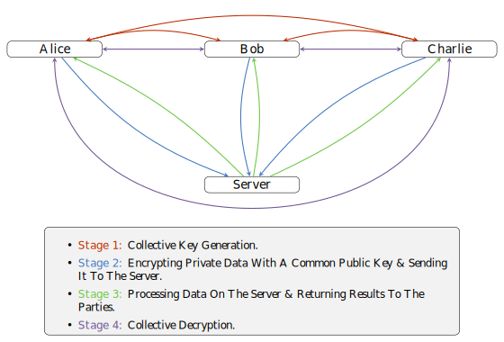

# Multiparty Computation (MPC) Support in HEonGPU

HEonGPU now supports Multiparty Computation (MPC) protocols through its implementation of the Multiparty Homomorphic Encryption (MHE) scheme, as described in the paper [Multiparty Homomorphic Encryption from Ring-Learning-With-Errors](https://eprint.iacr.org/2020/304). The MPC model employed in this implementation is based on N-out-of-N threshold encryption, which ensures that all participating parties must collaborate to decrypt or perform operations on the encrypted data. This integration has been carefully optimized for GPUs, enabling secure and efficient multiparty operations, tailored to meet the demands of modern computational workloads.

## MPC Supported Features

- Supports both the `BFV` and `CKKS` homomorphic encryption schemes.
- Compatible with `KEYSWITCHING_METHOD_I` and `KEYSWITCHING_METHOD_II` key switching methods. Note that `KEYSWITCHING_METHOD_III` key switching is not supported for MPC implementation.

  

### How It Works

1. **Collective Key Generation**  
   Parties collaboratively generate common public key and evaluation keys, which will be used for encrypting private data and evaluation. (See Stage 1 in the diagram above).
  **Note:**
  - Generating the common relinearization key required two consecutive interactive phases.

2. **Encrypt and Send**  
   Each party encrypts their private data using the common public key and sends the ciphertext to the server (See Stage 2).

3. **Server Processing**  
   The server performs the desired computations on the received ciphertexts without accessing the plaintext data and sends the results back to the parties (See Stage 3).

4. **Collective Decryption**  
   Parties collaborate to decrypt the server's results and securely retrieve the plaintext outputs. Each party partially decrypts the ciphertext using their own secret key and shares the partially decrypted results with the other participants. Once all partial decryptions are combined, the final plaintext output is obtained. Since this process follows the N-out-of-N threshold encryption model, every participant must contribute to the partial decryption for successful reconstruction of the result. (See Stage 4).

### How to Use

To enable MPC in your project, follow these steps:

1. **Integrate HEonGPU into Your Project**  
   Begin by integrating HEonGPU into your project. Detailed instructions for adding HEonGPU as a dependency can be found in the primary [README.md](../README.md) file in the root directory of the repository.

2. **Define Parameters for Collective Key Generation**  
   Utilize the provided APIs to set up parameters for collective key generation, including the common public key and evaluation keys.

3. **Encrypt and Execute**  
   Encrypt private data using the common public key and securely execute multiparty operations with HEonGPU's optimized infrastructure.

4. **Decrypt and Retrieve Results**  
   Use the decryption APIs to securely retrieve plaintext outputs from the server's results.

For a practical demonstration, refer to the [8_multiparty_computation_bfv.cu](8_multiparty_computation_bfv.cu)  and [9_multiparty_computation_ckks.cu](9_multiparty_computation_ckks.cu) files in the repository. This examples showcase a complete workflow for using HEonGPU's MPC capabilities, including key generation, encryption, computation, and decryption. 

## Upcoming Feature:

Future updates will bring enhanced capabilities for multiparty computations, including `t-out-of-N threshold encryption`. This advanced feature will allow subsets of participants to collaboratively decrypt and perform operations, offering greater flexibility and fault tolerance in distributed systems. By enabling partial decryption and cooperation among a limited number of parties.

In addition, `serialization support` is planned to enable saving and loading of encryption objects such as keys and ciphertexts. This will facilitate efficient storage and transmission of encrypted data across sessions or systems, improving both interoperability and convenience.

#

If you have further questions or require additional information, feel free to reach out at:
- Email: alisah@sabanciuniv.edu
- LinkedIn: [Profile](https://www.linkedin.com/in/ali%C5%9Fah-%C3%B6zcan-472382305/)